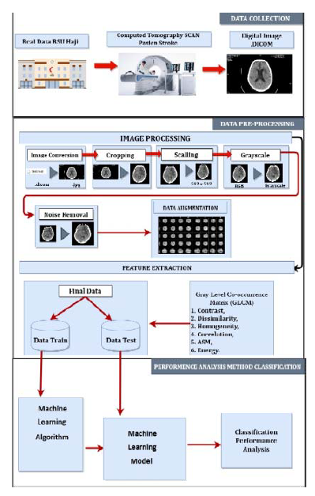
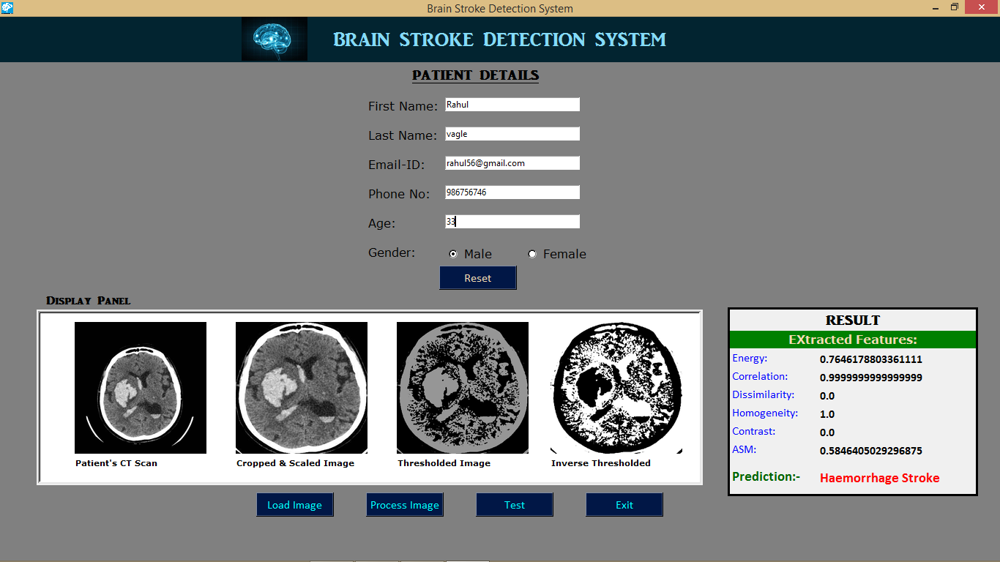

# BRAIN STROKE PREDICTION SYSTEM
A **Machine Learning** model that predicts the type of brain stroke suffered by patient using **CT-Scan** image of patient.  
There are basically two types of brain stroke:-
* **Ischemic Stroke** (*Blockage in the blood vessel or artery of the brain*)
* **Hemorrhagic Stroke** (*Bleeding in the brain due to rupture of blood vessel*)

## System Design

* Feature Extraction - **GLCM (Gray Level Co-Occurence Matrix)**
* Classifier Model - **Random Forest Model**
* Model Accuracy - **80%**   
Finally the trained model is deployed into a **GUI (Graphical User Interface)**

## GUI Sample

* GUI converts the CT-Scan Image format from **DICOM** to **JPG**
* GUI performs image processing like *Cropping, Scaling, Noise Removal, Thresholding*
* GUI performs feature extraction using GLCM
* The classifier model predicts the type of stroke and renders the result into the result pannel.
* GUI also saves the patient details and the result of prediction in a text file.  
**This project reduces the time required to detect the type of stroke suffered by patient.
During emergency condition,Only by doing normal CT scan, the model can predict the type of stroke.
It solves the dilemma of doctors whether to go for MRI or not. AS MRI almost take 40-45 minutes and its very expensive.**

